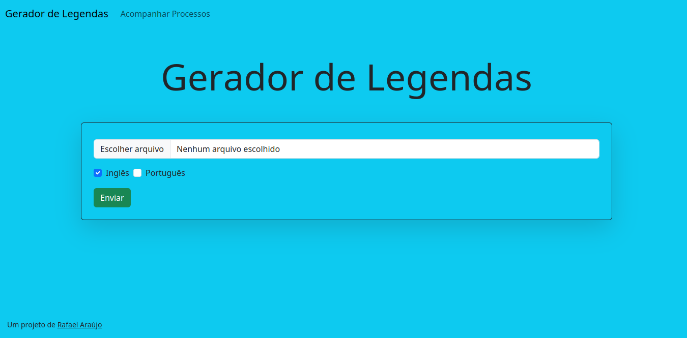

# Gerador de Legendas
### Plataforma simples para geração de arquivos .srt
---

 
# Como usar
1. Clone o repositório e navegue até o diretório criado

```
git clone https://github.com/araujorafael9201/gerador-de-legendas.git 
cd gerador-de-legendas
```
2. Instale as dependências necessárias
```
pip install -r requirements.txt
```
3. Execute
```
python main.py
```
4. A interface web estará disponível em localhost:5000
---
## Como funciona
### Interface Web
- A interface web foi construída utilizando o framework [Flask](https://flask.palletsprojects.com/en/2.2.x/)
### Passo-a-Passo: Geração de Lengendas
1. Extração do áudio
2. Detecção de silêncios
3. Fragmentação do áudio de acordo com os tempos das falas
4. Transcrição e tradução individual de cada falas
5. Formatação do arquivo final
